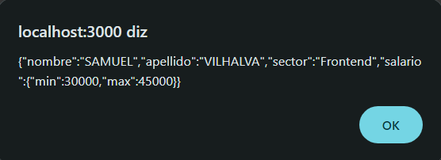
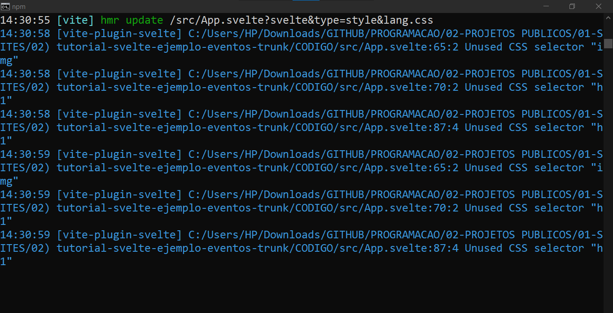

# FORMULARIO DE TRABALHO COM SVELTE
👨‍🏫PROJETO CRIADO PARA O CURSO DE SVELTE.

 <br> 
 <br> 
 <br> 

## DESCRIÇÃO:
- Este é um aplicativo web simples que permite aos usuários inserir informações pessoais e de trabalho, incluindo nome, sobrenome, setor de trabalho e faixa salarial. Ele também valida se o salário mínimo inserido é menor ou igual ao salário máximo.

- Quando o usuário preenche o formulário e clica no botão "ENVIAR", os dados são serializados para formato JSON e exibidos em um alerta. Além disso, o aplicativo verifica se o salário mínimo inserido é menor ou igual ao salário máximo. Se não for, exibe uma mensagem de erro na página.

## EXECUTANDO O PROJETO:
1. **Instalar as dependências do projeto**:
   - Execute o comando no diretório `CODIGO/`:
     ```cmd
     npm install
     ```
   Este comando instala todas as dependências listadas no arquivo `package.json` do seu projeto. 

2. **Executando o Aplicativo:**
   - Ainda no diretório `CODIGO/`, abra o terminal ou prompt de comando e digite o seguinte comando:
   ```bash
   npm run dev
   ```
   - Acesse o aplicativo no navegador visitando `http://localhost:3000/`.

3. **Usando o APP:**
   1. Preencha os campos "NOME" e "SOBRENOME" com suas informações pessoais.
   2. Selecione um setor de trabalho no menu suspenso "SEÇÃO".
   3. Defina a faixa salarial desejada arrastando os controles deslizantes ou inserindo manualmente o valor mínimo e máximo.
   4. Clique no botão "ENVIAR" para enviar o formulário.
   5. Se houver algum erro, como o salário mínimo sendo maior que o salário máximo, uma mensagem de erro será exibida abaixo do formulário.

## NÃO SABE?
- Entendemos que para manipular arquivos em `HTML`, `CSS` e outras linguagens relacionadas, é necessário possuir conhecimento nessas áreas. Para auxiliar nesse aprendizado, oferecemos cursos gratuitos disponíveis:
* [CURSO DE HTML E CSS](https://github.com/VILHALVA/CURSO-DE-HTML-E-CSS)
* [CURSO DE NODEJS](https://github.com/VILHALVA/CURSO-DE-NODEJS)
* [CURSO DE SVELTE](https://github.com/VILHALVA/CURSO-DE-SVELTE)
* [CONFIRA MAIS CURSOS](https://github.com/VILHALVA?tab=repositories&q=+topic:CURSO)

## CREDITOS:
- [PROJETO CRIADO PELO "makigas"](https://github.com/makigas/tutorial-svelte-ejemplo-eventos)
- [PROJETO CRIADO PARA O CURSO DE SVELTE](https://github.com/VILHALVA/CURSO-DE-SVELTE)
- [PROJETO FEITO PELO VILHALVA](https://github.com/VILHALVA)


